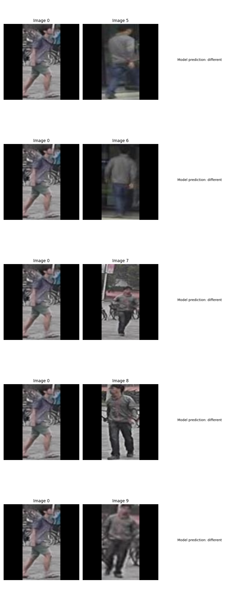

# Deep Person Reid


The primary objective is to design and implement a machine learning model that integrates the Siamese network with autoencoders, utilizing several backbone architectures including ResNet-152, DenseNet, VGG, and Swin Transformer for robust feature extraction. This combination aims to improve the model's ability to handle variations in lighting, pose, and occlusion that typically challenge surveillance systems.

Key topics and methodologies employed include:

Data Preprocessing: Image resizing, mirroring (horizontal flips), and standardizing for data augmentation.
Model Architecture: A Siamese network combined with autoencoders using different backbones to enhance discriminative feature learning and effective dimensionality reduction.
Loss Functions: Utilization of Triplet Loss, KL Divergence, Reconstruction Loss, Sparsity Loss, and Binary Cross-Entropy to fine-tune the learning process.
Multi-Objective Optimization: A strategic architecture to simultaneously minimize several loss functions, balancing various aspects of the learning process.

The project utilizes the Market-1501 dataset, a benchmark for ReID tasks, to train and test the model. Performance metrics such as Mean Average Precision (mAP) and Cumulative Matching Characteristics (CMC) were used to evaluate the model. The results indicate that various pairings of autoencoders and selected backbones yield different levels of performance, with the Swin Transformer and Variational Autoencoder emerging as the most effective combination.


### prepare dataset
prepare.py

It splits the dataset into a validation set and a test set. Files are randomly moved to either the validation or test folder. The splitting ratio is 60% for the test set and 40% for the validation set. After splitting, it checks the class distribution in the validation folder. If any class has less than two instances, it removes those instances. This ensures each class in the validation set has at least two instances for robust evaluation.

### train the model
train.py:
```
  --lr: Sets the learning rate. 
  --lr-classifier: Sets the learning rate for the classifier. 
  --triplet: Sets the value of the triplet loss.
  --kl: Specifies the weight for the KL divergence loss term in a VAE (Variational Autoencoder). 
  --reconstruction: Specifies the weight for the reconstruction loss term in the VAE. --bce : Sets the weight for the binary cross-entropy loss term.
  --sparsity: Sets the sparsity parameter. 
  --backbone-name: Specifies the backbone architecture.
  --ae-name: Specifies the type of autoencoder 
  --result-dir: Specifies the directory where the results will be saved
  --pre-backbone: Directory path to pretrained backbone
  --pre-ae: Directory path to pretrained autoencoder
  --pre-classifier: Directory path to pretrained classifier
```


### evaluate the embeddings
eval.py:
  ```
	--backbone_dir: Directory path to pretrained backbone 
  --backbone_type: Name of the backbone used
  --classifier_dir: Directory path to pretrained classifiers
  --ae_dir: Directory path to pretrained autoencoder
  --ae_type: Name of the autoencoder used
  --dataset_dir: Directory path to dataset 
  --all-dir: Directory path to pretrained model (using the specified backbone and autoencoders)
```
### find the top-k images
topk.py:
```
	--backbone_dir: Directory path to pretrained backbone 
  --backbone_type: Name of the backbone used
  --classifier_dir: Directory path to pretrained classifiers
  --ae_dir: Directory path to pretrained autoencoder
  --ae_type: Name of the autoencoder used
  --dataset_dir: Directory path to dataset
```



